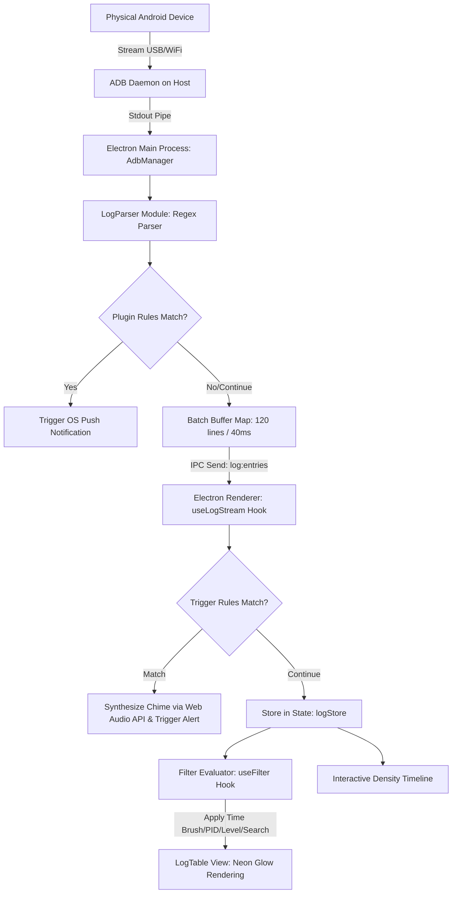

# 🌌 SmartLogcat: Next-Gen Android Logcat Streamer & Profiler

<div align="center">

  
  <br>

  [](https://electronjs.org)
  [](https://react.dev)
  [](https://www.typescriptlang.org/)
  [](https://github.com/WiseLibs/better-sqlite3)
  [](https://github.com/joelindracr/SmartLogcat)
</div>

---

**SmartLogcat** is an industrial-grade desktop utility engineered using **Electron**, **React**, **TypeScript**, and **SQLite**. It is purpose-built for mobile developers, QA engineers, and security researchers to stream Android system logs in real-time, profile device performance metrics, isolate targeted packages, and automate smart event alerts using a premium, cyberpunk-themed **Deep Space** neon user interface.

---

## 🎨 The Logo Concept: Cyber-Code Cat

SmartLogcat features a premium, minimalist cyberpunk design philosophy. The logo integrates the two core elements of the project's identity—**Cats** and **Code Logs**:
*   **The Cybermatic Face Outline:** Sleek, symmetrical geometric lines drawn in glowing **Neon Purple** (representing abyssal outer space) and **Neon Cyan** (representing high-fidelity digital channels).
*   **Code-Bracket Eyes (`<` and `>`):** In a clever easter egg, the cat's eyes are formed from **emerald green code tags**—blending software development directly with the feline aesthetic.
*   **Log Line Whiskers:** Symmetrical horizontal line dashes that represent stream lines in active terminal outputs.

---

## 🚀 Download Pre-compiled Desktop App

No need to clone code or run build scripts! You can download the production installer directly:
1. Navigate to the [Releases](https://github.com/joelindracr/SmartLogcat/releases) tab on the right side of this repository.
2. Download the latest `Smart Logcat Viewer Setup 1.0.0.exe` for Windows.
3. Install the application with a single click and launch it directly from your desktop.

---

## 📊 Feature Comparison: SmartLogcat vs Standard Tooling

Here is how SmartLogcat compares to standard Android Studio logcat and classic command-line utilities:

| Capability / Pillar | 🌌 SmartLogcat | 🛠️ Android Studio Logcat | 🐚 Standard CLI (`adb logcat`) |
| :--- | :--- | :--- | :--- |
| **Dynamic PID Filtering** | **Yes** (Auto-tracks and updates PIDs during app crash/restart via background poller) | Limited (requires manual re-selection upon app restart) | None (requires manual grep/find processes) |
| **Audio Telemetry (Audio Chime)** | **Yes** (Instant synthesized high-fidelity digital chime via Web Audio API) | None | None |
| **Device Control Cockpit** | **Yes** (GUI controls for Launch, Force-stop, Clear Data, and Mock Battery) | Partial (no Mock Battery controls) | None (requires typing long shell commands manually) |
| **Interactive Scrubber Timeline** | **Yes** (Click-and-drag SVG density brush selector to isolate millisecond windows) | None | None |
| **Integrated Performance Profiler** | **Yes** (Real-time CPU sparkline & memory breakdowns for PSS, Native, and Dalvik) | Separate (requires opening full resource profiler tab) | None |
| **Persistent Session Storage** | **Yes** (Integrated local relational SQLite database) | None | None (requires manual shell redirects to txt files) |
| **Desktop Fatal Crash Alert** | **Yes** (Instant OS-level push notifications for `Fatal` level occurrences) | None | None |

---

## ⚡ 9 Core Feature Pillars & Technical Architecture

### 1. Real-Time Streaming & IPC Batching Optimization
When an Android device streams logs in high-volume environments, Electron's Inter-Process Communication (IPC) channel can become saturated, freezing the main renderer thread.
*   **The Technical Solution:** SmartLogcat implements a high-performance **Buffer & Batching** engine. Raw log entries piped from the ADB stream are accumulated in memory per device in the Main process. The main process flushes the buffer to the Renderer process collectively once the queue reaches **120 entries** or every **40 milliseconds**. This lowers CPU overhead by up to 80% under high log volume stresses.

### 2. Device Control Cockpit
A centralized interface designed to command the physical or virtual Android device's application state directly from the desktop dashboard.
*   **Launch App:** Starts the targeted package using Android's Monkey tool:
    ```bash
    adb -s <deviceId> shell monkey -p <packageName> -c android.intent.category.LAUNCHER 1
    ```
*   **Force Stop & Clear Data:** Forcefully kills active processes and wipes all package cache and data:
    ```bash
    adb -s <deviceId> shell am force-stop <packageName>
    ```
    ```bash
    adb -s <deviceId> shell pm clear <packageName>
    ```
*   **Mock Battery Level:** Tests application behavior under low-power states by faking battery levels:
    ```bash
    adb -s <deviceId> shell dumpsys battery set level <0-100>
    ```
    ```bash
    adb -s <deviceId> shell dumpsys battery set status 2
    ```

### 3. Smart Log Triggers & Alerts
Allows developers to define robust alert criteria matching logs using either plain-text (*String*) queries or Complex Regular Expressions (*Regex*).
*   **Audio Chime Synthesis:** Avoids bulky file asset dependencies by leveraging the HTML5 **Web Audio API (`AudioContext`)** to synthesize clean digital synthesizer chimes directly through software. It ramps a digital oscillator frequency exponentially from D5 (587.33Hz) to A5 (880Hz) in 0.25 seconds, delivering a premium notification signal without loading audio files.
*   **Neon Row Highlight Glow:** Log rows matching active trigger filters are rendered with striking glowing neon borders based on chosen color themes (Rose, Purple, Blue, Cyan, Emerald, Gold, Orange).

### 4. Real-Time Performance Profiler
Tracks system metrics and hardware stress limits of the targeted package live while you debug:
*   **CPU Utilization:** Monitors live CPU percentage usage of the running package.
*   **Memory PSS (Proportional Set Size):** Breaks down allocations into **Native Heap**, **Dalvik Heap (Java)**, and **Total PSS** (in Megabytes) by parsing data in real-time from:
    ```bash
    adb -s <deviceId> shell dumpsys meminfo <packageName>
    ```
*   Divides visual data into ultra-lightweight, customizable SVG sparkline charts.

### 5. Interactive Time-Scrubber Timeline
A dynamic timeline visualizer that divides the active log stream into 40 distinct time-slice bins.
*   Displays real-time level density (Verbose, Debug, Info, Warning, Error, Fatal) using colored indicators.
*   Supports **Interactive Brushing**: Developers can click and drag over any timeline region to instantly filter the main log grid to only display events occurred within the selected millisecond window.

### 6. Wi-Fi Wireless Debugging (Pair & Connect)
Declutter your workstation by debugging over wireless networks:
*   Pairs with wireless devices using IP, Port, and a random pairing code:
    ```bash
    adb pair <ip>:<port> <code>
    ```
*   Connects directly to the paired wireless target:
    ```bash
    adb connect <ip>:<port>
    ```

### 7. Hybrid Fast-Fetch Packages & PID Watcher
*   **Hybrid Package Query:** Upon connecting a device, SmartLogcat immediately grabs active running processes via `ps -A` (~50ms) to populate the autocomplete list in under 100ms, while loading the comprehensive installed packages list (`pm list packages`) in the background.
*   **Dynamic PID Watcher:** Android re-assigns process IDs (PIDs) every time an app crashes or restarts. SmartLogcat polls package process IDs every 1.5 seconds using `pidof <packageName>`. The table filters automatically shift to the newly assigned PIDs without user intervention, ensuring zero log loss.

### 8. Smart Log Parser & HTTP Sniffer
Every raw logcat line is processed by a Regex compiler in the main process to extract rich structured metadata.
*   **AI-Inspired Smart Exception Categorization:** Automatically catches common crash types and highlights immediate remedies, such as:
    *   *NullPointerException* -> Action: "Check null safety before accessing object."
    *   *OutOfMemoryError* -> Action: "Inspect for memory leaks using LeakCanary."
    *   *ANR (Application Not Responding)* -> Action: "Ensure the main UI thread is not blocked by heavy I/O."
*   **HTTP Traffic Detection:** Detects OkHttp/Retrofit log formats to isolate HTTP Requests and Responses (tracking status codes, methods, urls, and server latency times in milliseconds).

### 9. SQLite-Powered Session Store
Streamed logs can be saved directly as persistent local sessions to an integrated **better-sqlite3** relational database, allowing offline analysis or team review at any time without reconnecting the device.

---

## 📐 Data Flow Architecture

The diagram below illustrates the path an Android log takes from the physical target to the Electron React UI:



---

## 🗃️ SQLite Database Schema

Debugging sessions are stored locally in the `sessions.db` file within the application's native `userData` folder.

### Table: `sessions`
This table records session metadata along with the serialized log payload saved as a JSON string.

| Column | Data Type | Constraint | Description |
| :--- | :--- | :--- | :--- |
| `id` | `TEXT` | PRIMARY KEY | Unique identifier (epoch millisecond string). |
| `name` | `TEXT` | NOT NULL | Custom user-defined label or name for this session. |
| `deviceId` | `TEXT` | NOT NULL | Serial number / identifier of the targeted Android device. |
| `deviceName` | `TEXT` | - | Optional market name of the targeted device. |
| `startedAt` | `INTEGER` | NOT NULL | Epoch timestamp (milliseconds) representing when the session was created. |
| `logs` | `TEXT` | NOT NULL | Compressed/serialized JSON string of the complete list of `LogEntry` objects. |

---

## 🔧 Local Development & Build Setup

### Prerequisites
1.  **Node.js** (Version 18+ recommended).
2.  **ADB (Android Debug Bridge)** added to your system's environment variables (`PATH`).
    > [!TIP]
    > If ADB is missing from your system `PATH`, SmartLogcat has a platform-tools recovery routine that checks for a local copy within the application's internal data directory.

### Setup Instructions
1.  Clone this repository and navigate to the directory:
    ```bash
    git clone https://github.com/joelindracr/SmartLogcat.git
    cd SmartLogcat
    ```
2.  Install all package dependencies:
    ```bash
    npm install
    ```
3.  Launch the app in local developer mode:
    ```bash
    npm run dev
    ```
4.  Compile and Package the Desktop App Installer (`.exe` / `.dmg` / `.deb`):
    ```bash
    npm run pack
    ```
    The compiled production setup installer will be output directly to the `./dist` folder.

---

## 🎨 UI Design Tokens (Deep Space Design System)

SmartLogcat is built using a dark glassmorphic outside-space visual identity, incorporating distinct cyberpunk color contrasts:

*   **Primary Background:** `#0a0a0f` (Abyssal Dark Space)
*   **Panel Background:** `#0f172a / 50% opacity` (Glassmorphic Slate with background blur)
*   **Glow Neon Highlight Triggers:**
    *   🔴 **Neon Rose:** `#f43f5e` (Fatal Crashes / Critical Errors)
    *   🟣 **Neon Purple:** `#a855f7` (Network API Traffic / OkHttp logs)
    *   🔵 **Neon Blue:** `#3b82f6` (General Debug logs)
    *   🟢 **Neon Emerald:** `#10b981` (Information / Success events)
    *   🟡 **Neon Gold:** `#eab308` (Warnings)

---

## 🛠️ Troubleshooting Guide

### 1. Android Device is Not Displayed in the Sidebar
*   **Root Cause:** The ADB USB driver is missing, or *USB Debugging* is disabled on the physical phone.
*   **Resolution:**
    1.  On your phone, navigate to **Settings** -> **About Phone** -> Tap **Build Number** 7 times to unlock Developer Options.
    2.  Open **Developer Options** -> toggle **USB Debugging** to ON.
    3.  When connecting the cable, accept the authentication popup dialog ("Allow USB Debugging from this computer").
    4.  Verify status in your terminal by running `adb devices`. Make sure the device status is listed as `device` (not `unauthorized` or `offline`).

### 2. UI Rendering Lags Under Intense Log Flow
*   **Root Cause:** System logs from background system processes or unrelated system apps are flood-streaming.
*   **Resolution:** Isolate and target your specific application process. Input your application's package name (e.g., `com.company.app`) in the Package Filter search bar on the left sidebar. This tracks process PIDs and filters out 95% of unrelated garbage logs, instantly restoring fluid UI rendering.

### 3. Performance Profiler Charts Display as Blank / Flat Lines
*   **Root Cause:** No package has been selected, or the filtered application is not currently active on the device (thus lacking a process ID).
*   **Resolution:** Type the exact target package (e.g., `com.example.app`) in the sidebar package search field, and ensure the application is active and running on your phone.

---

## 🎯 Developer Diagnostics Workflow

### Scenario: Spotting and Saving a Null Pointer Exception
1.  Connect your Android device over USB or Wi-Fi.
2.  Select your target device from the device sidebar selector.
3.  Search and select your application package (e.g., `com.company.app`) to isolate its logs.
4.  Open the **Smart Log Triggers & Alerts** dialog (Sparkle icon on the toolbar).
5.  Create a custom trigger rule:
    *   *Pattern:* `NullPointerException`
    *   *Highlight:* Enabled (select **Neon Rose** 🔴)
    *   *Sound Chime & Push Notification:* Enabled
6.  Interact with the app on the phone to reproduce the crash.
7.  SmartLogcat immediately triggers an OS-level push notification, synthesizes an alert chime, and highlights the exact crash log row in glowing Neon Rose.
8.  Click the highlighted log row to read the full formatted *Stack Trace* and check recommendation insights on the right-hand panel.
9.  Click **Save Session** to store the logs securely in SQLite so your teammates can review it later.

---

## 📄 License & Copyright

Designed and developed with passion by **Joel Indra CR**.

<div align="center">
  
  <br>
  <sub>Copyright © 2026 Joel Indra CR. All rights reserved.</sub>
</div>
